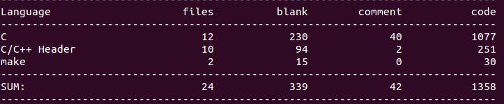

# 高性能HTTP服务器

## 开发文档
| Part Ⅰ | Part Ⅱ | Part Ⅲ | Part Ⅳ | Part Ⅴ | Part Ⅵ | Part Ⅷ | Part Ⅸ | Part Ⅹ |
| :--------: | :---------: | :---------: | :---------: | :---------: | :---------: |:--------:| :--------:|:--------:|
|  [项目目的](https://github.com/LuckyGrx/FTP/blob/master/%E9%A1%B9%E7%9B%AE%E7%9B%AE%E7%9A%84.md)  | [并发模型](https://github.com/LuckyGrx/FTP/blob/master/%E5%B9%B6%E5%8F%91%E6%A8%A1%E5%9E%8B.md)|[核心结构体](https://github.com/LuckyGrx/FTP/blob/master/%E6%A0%B8%E5%BF%83%E7%BB%93%E6%9E%84%E4%BD%93.md)|[整体设计](https://github.com/LuckyGrx/FTP/blob/master/%E6%95%B4%E4%BD%93%E8%AE%BE%E8%AE%A1.md)|  [主要函数](https://github.com/LuckyGrx/FTP/blob/master/%E4%B8%BB%E8%A6%81%E5%87%BD%E6%95%B0.md)| [遇到的问题](https://github.com/LuckyGrx/FTP/blob/master/%E9%81%87%E5%88%B0%E7%9A%84%E9%97%AE%E9%A2%98.md) |  [测试及改进](https://github.com/LuckyGrx/FTP/blob/master/%E6%B5%8B%E8%AF%95%E5%8F%8A%E6%94%B9%E8%BF%9B.md) | [背景知识](https://github.com/LuckyGrx/FTP/blob/master/%E8%83%8C%E6%99%AF%E7%9F%A5%E8%AF%86.md)|[使用教程](https://github.com/LuckyGrx/FTP/blob/master/%E4%BD%BF%E7%94%A8%E6%95%99%E7%A8%8B.md)|

---

## 开发环境

### 开发工具

- 操作系统: Ubuntu 14.04

- 编辑器: VSCode + Vim

- 编译器: gcc 4.8.4

- 版本控制: git

### 其他

- 压测实现: Webbench

- 自动化构建: 

## 时间线

### 目前

- v1.0正在实现

    - 服务器端特性:

        - 高并发模型

            - 非阻塞I/O

            - epoll边缘触发模式 (ET)

        - 添加定时器,定时关闭非活动连接

            - 高效的时间轮结构 + 信号(SIGALRM)

        - 线程池操作及其同步互斥管理

        - 使用有限状态机解析HTTP协议(HTTP1.0, HTTP1.1)

            - 请求方法: GET, POST, HEAD