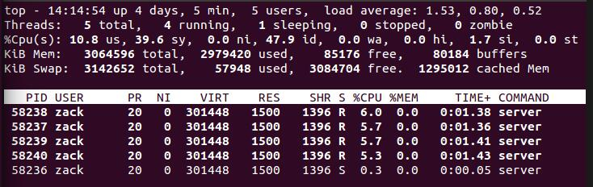
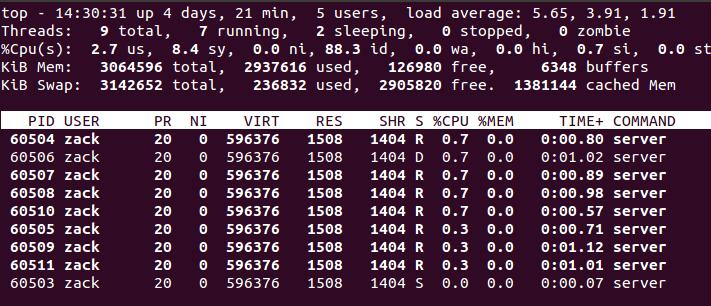

# 测试及改进

## 测试结果

- 自己写了测试程序,并发数及工作线程数为测试内容

- 测试环境为本地虚拟机,配置4核心i5处理器

1000并发量

在1000并发量下,服务器并未因线程增多性能有所提升,通常线程数为CPU核心数

- 4个工作(worker)线程

    - 系统负载(可以看出来程序消耗内存过大,可以进行优化工作,待改进)
    

- 8个工作(worker)线程

    - 系统负载(为什么会有D状态,待解决)
    

