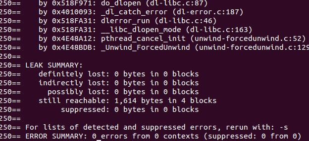

1. 服务器端接收文件的正确性？
     - 问题：

          - 字节流文件无法通过查看内容或者简单的查看文件字节数验证正确性

     - 解决办法：

          - 使用md5sum验证

2. 为了提高并发性而产生的错误？
     - 问题：

          - 为了提高并发性，将任务处理函数放置在互斥锁外执行时，会存在文件传输错误的情况

     - 原因：

          - 当某个工作（worker）线程在执行任务处理函数里的IO操作时，要是该任务绑定的已连接描述符有新的数据达到，会触发其他工作（worker）线程去处理该这些数据，导致两个worker线程同时修改同一个结构体的情况

     - 解决办法:

          - 添加EPOLLONESHOT模式，强制只读一次至读到EAGAIN为止，并epoll_mod该可读事件

3. 线程池的实现？
     - 使用互斥锁保证对线程池的互斥访问，使用条件变量实现同步

     - 初始化线程池，创建工作（worker）线程

     - 各线程入口函数最外层为while循环，获得互斥锁的线程进入线程池，若任务（task）队列为空，则该工作（worker）线程阻塞在pthread_cond_wait上。若任务（task）队列非空，则取出任务（task）队列的第一个任务，之后立即开锁，并执行任务对应的任务处理函数

     - 建立连接后，当客户端请求到达服务器端时，创建任务（task）并添加到线程池的任务队列尾部，当添加完任务(task)之后调用pthread_cond_signal唤醒阻塞在pthread_cond_wait上的没有具体任务（task）的工作（worker）线程


4. 为了解决粘包、缺包问题而使用的有限状态机的实现？
     - 收包状态： 
     ```C++                   
          - head_init          // 初始状态，准备接收包头
          - head_recving       // 接收包头中
          - body_init          // 包头收完，准备接收包体
          - body_recving       // 接收包体中
     ```
     - 请求结构体（和解析请求的有限状态机关联的部分）：
     ```C++
          - enum state       curstate;
          - char             head[sizeof(request_pkg_head_t)];   // 存放包头信息
          - char*            recv_pointer;                       // 接收数据缓冲区的指针
          - unsigned int     need_recv_len;                      // 还要接收多少数据
     ```

     每个请求结构体初始化为：
     ```C++
	     request->curstate = head_init;
	     request->recv_pointer = request->head;
	     request->need_recv_len = sizeof(request_pkg_head_t);
     ```
     request_control函数内死循环实现：
     ```C++
		int reco = recv(request->fd, request->recv_pointer, request->need_recv_len, 0);
     ```
     
     - 要是请求当前状态为head_init，

          - 要是 request->need_recv_len == reco, 说明包头收完整了，则

               ```C++
			request->curstate = body_init;
			request->recv_pointer = (char*)calloc(body_len, sizeof(char));
			request->need_recv_len = body_len;
               ```

          - 否则，说明包头收到的不完整，则

               ```C++
               request->curstate = head_recving;
			request->recv_pointer = request->recv_pointer + reco;
	          request->need_recv_len = request->need_recv_len - reco;
               ```

     - 要是请求当前状态为head_recving，

          - 要是 request->need_recv_len == reco, 说明包头收完整了，则

               ```C++
			request->curstate = body_init;
			request->recv_pointer = (char*)calloc(body_len, sizeof(char));
			request->need_recv_len = body_len;
               ```

          - 否则，说明包头收到的不完整，则

               ```C++
			request->recv_pointer = request->recv_pointer + reco;
			request->need_recv_len = request->need_recv_len - reco;   
               ```

     - 要是请求当前状态为body_init，
          - 要是 request->need_recv_len == reco，说明包体收完整了，则

               ```C++
               request->curstate = head_init;
	          request->recv_pointer = request->head;
	          request->need_recv_len = sizeof(request_pkg_head_t);
               ```

          - 否则，说明包体收到的不完整，则

               ```C++
               request->curstate = body_recving;
			request->recv_pointer = request->recv_pointer + reco;
		     request->need_recv_len = request->need_recv_len - reco;
               ```

     - 要是请求当前状态为body_recving，
          - 要是 request->need_recv_len == reco，说明包体收完整了，则

               ```C++
               request->curstate = head_init;
	          request->recv_pointer = request->head;
	          request->need_recv_len = sizeof(request_pkg_head_t);
               ```

          - 否则，说明包体收到的不完整，则

               ```C++
               request->recv_pointer = request->recv_pointer + reco;
			request->need_recv_len = request->need_recv_len - reco;
               ```

5. 线程池的同步互斥实现？

     线程同步互斥问题可以使用互斥锁、条件变量、读写锁和信号量。

     主线程负责监听并添加任务（添加回调函数、创建参数）到线程池中，之后工作（worker）线程负责取出任务并执行

     项目采取的同步策略是“互斥锁 + 条件变量"。
     ```C++
     int pthread_mutex_lock(pthread_mutex_t *mptr);
     int pthread_mutex_unlock(pthread_mutex_t *mptr);
     int pthread_cond_wait(pthread_cond_t *cptr, pthread_mutex_t *mptr);
     int pthread_cond_signal(pthread_cond_t *cptr);
     ```

6. 上传文件完整过程？
     - 客户端
          - 使用mmap系统调用映射文件到共享内存区，按块大小（1024字节）封包（包头 + 包体）发送给服务器
     - 服务器端
          - 收全包体后，立即以追加模式写入文件中

7. SIGPIPE

   默认情况下，往一个读端关闭的socket连接中写数据将引发SIGPIPE信号，我们需要在代码中捕获该信号并忽略该信号，因为程序接收到SIGPIPE信号的默认行为是结束进程（假设服务器端往客户端发送文件的过程中，客户端关闭了，SIGPIPE信号的默认行为导致服务器进程关闭）

8. 定时器时做什么的,怎么实现的?

     - 时间轮上有若干个槽位,每个槽位上放置着定时器的双向链表

     - 主线程定时发送信号,对时间轮的当前指向槽位进行自增,要是当前指向槽位上的某个定时器超时了,则删除该定时器

9. epoll底层实现及其核心参数

     - 执行epoll_create时创建红黑树和就绪链表,执行epoll_ctl时,如果增加的文件描述符在红黑树中存在则立即返回,不存在则添加描述符到红黑树中并向内核注册相应的回调函数.当事件到来时向就绪链表插入描述符及其回调信息

     - epoll有两种工作模式,分别为ET 和 LT,默认为LT,在LT下只要socket的内核接收/发送缓冲区里的数据没有处理完,每次epoll_wait都会返回,而ET模式只在状态发生变化时返回(由可读变成不可读,可写变成不可写,或epoll_mod该事件)

10. 使用top -H -p pid时,发现处于Sleep状态的线程数,和预设值不符

     - 怀疑命令使用出错: 在线程入口函数的死循环内,打印线程的id,发现只有和top命令一样数量的线程处于阻塞态

     - 怀疑配置文件读取出错: 打印conf.threadnum值,发现值和配置文件值不一致,发现代码编写错误,已修复

11. 发送大文件时,发生主线程阻塞的情况(阻塞在epoll_wait)?

     - 怀疑客户端数据没有发送过来:使用过netstat -na | grep 127.0.0.1 发现recv-Q里有大量残余数据

     - 断定epoll_wait监听的事件没有被触发,检查发现添加了EPOLLONESHOT后事件只会被触发一次,之后必须epoll_mod该事件,才能处于可被再次触发的状态

12. 编写threadpool_destroy()方法时,发现只能唤醒一个阻塞态的线程,很奇怪?

     - pthread_cond_wait(): 先释放互斥锁,然后将线程放入阻塞队列,之后等待信号唤醒,信号来了,在加互斥锁

     - 第一个唤醒的线程break出死循环后,没有解开互斥锁,导致之后的所有阻塞队列里的线程都阻塞在加锁那个环节了

13. lsof -p pid 发现服务器打开文件描述符数量过大?(修改进程能打开的最大文件描述符数  ulimit -n 65535)

     - 创建connection.filefd的时候,加上判断,要是不为-1,则先关闭该文件描述符,再创建新的文件描述符

     - ftp_connection_close()里没有关闭描述符

14. 发现一个问题,注释掉主线程的死循环后,用valgrind检测内存泄露,发现有时候有泄露,有时候又没有,具有偶然性,==(不清楚原因)
    


15. 在压力测试时(10个并发连接),运行一段时间后,终止压力测试,发现无法正常进行心搏函数的启动(关闭非活动连接)?

     - 使用strace发现,系统调用停止在epoll_wait处,即timeout未起作用,查看该出代码(打印timeout后,发现timeout小于0,发现遗漏解引用)

```C++
	if (events_num == 0) {// 说明超时时间到,处理定时任务
		*timeout = time_wheel.slot_interval * 1000;
		time_wheel_tick();
		goto begin;
	} else {// 说明有事件发生
		end = time(NULL);
		*timeout -= (end - start) * 1000;
          //(这里漏了解引用)
		if (timeout <= 0) {// 说明在有事件发生时,超时时间到(存在小于0的情况)
			*timeout = time_wheel.slot_interval * 1000;
			time_wheel_tick();
		}
	}
```

17. 压力测试下,测试文件一致性的命令(替换puts.txt即可)
```Shell
md5sum puts.txt* | cut -d ' ' -f 1 | uniq
```

18. 压力测试下,压测程序没按正常流程运转,send的结果报errno=104的错误

     服务器端发现连接超时后,关闭了该socket,但客户端仍然发送数据,服务端就会回一个RST报文,提示errno=104


19. 删除定时器的时候,发现在一些情况下,定时器所在的槽位大于时间轮的槽数大小?

     - 程序运行发生段错误,使用ulimit -c unlimited生成core文件
     
     - gdb ./server ./core 文件  print timer->slot 发现结果随机,而且很大

     - 定位到timer_del函数,发现free(timer)后,并没有将野指针置为NULL

     - 解决方法有两个:

          - 删除connection->timer后,将connection->timer置为NULL

          - 调整epoll_mod方法和timer_add方法的顺序(将timer_add方法放在epoll_mod方法的前面,避免epoll_mod后,数据来时先进行timer_del方法(这时候,connection->timer还没有更新成timer_add中新增的定时器),会导致connection->timer指向的还是原来的堆空间,其结果不确定)

20. 线程虚假唤醒
     ```C++
     while (条件不满足) {  
        condition_wait(cond, mutex);  
     }  
     //而不是:  
     if (条件不满足){  
        condition_wait(cond, mutex);  
     } 
     ```
     这是因为可能会存在虚假唤醒”spurious wakeup”的情况。 

     也就是说,即使没有线程调用condition_signal, 原先阻塞在condition_wait的线程也可能会返回。此时线程被唤醒了，但是条件并不满足，这个时候如果不对条件进行检查而往下执行，就可能会导致后续的处理出现错误。


